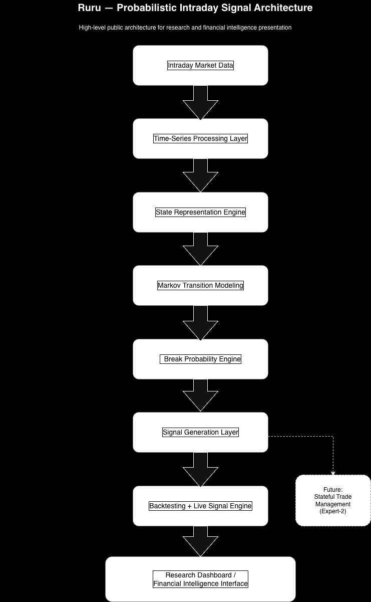

# Ruru Research

Quantitative research framework for intraday market state modeling, probabilistic signal discovery, and historical replay backtesting using high-frequency financial data.

## Overview

Ruru is a quantitative research system designed to model intraday market structure using probabilistic state-transition methods rather than direct price prediction. The framework transforms high-frequency market data into structured market states, estimates directional break probabilities, and evaluates signal quality using historical replay backtesting.

The current public repository presents the research-facing portion of the system, including methodology, architecture, signal examples, summary results, and public-safe evaluation artifacts.

## Research Objective

The core goal of Ruru is to study whether probabilistic modeling of short-term market state transitions can produce useful directional signal intelligence in intraday financial markets.

Rather than forecasting raw prices, the system focuses on:

- structural event detection
- directional breakout probability estimation
- confidence-aware signal evaluation
- replay-based research validation

## High-Level Architecture

Pipeline:

1. Intraday Market Data  
2. Time-Series Processing Layer  
3. State Representation Engine  
4. Markov Transition Modeling  
5. Break Probability Engine  
6. Signal Generation Layer  
7. Backtesting + Live Signal Engine  
8. Research Dashboard / Financial Intelligence Interface  

Future extension:
- Expert-2: stateful trade lifecycle management

## Methodology

The framework consists of the following stages:

### 1. Time-Series Processing
Raw 1-minute intraday market data is transformed into structured features suitable for statistical modeling.

### 2. State Representation
Short-term market conditions are encoded into discrete structural states representing local market behavior.

### 3. Probabilistic Transition Modeling
State transitions are modeled using a Markov-style framework to estimate the probability of structural market shifts.

### 4. Break Probability Estimation
The system computes directional probabilities for upward and downward break events and generates signals when structural conditions are satisfied.

### 5. Historical Replay Backtesting
Signals are evaluated across forward horizons using replay over historical sessions.

## Evaluation Framework

Signals are evaluated using short-horizon forward returns, including:

- 1 minute
- 3 minutes
- 9 minutes
- 15 minutes

Primary evaluation dimensions include:

- directional accuracy
- aligned move magnitude
- probability calibration
- signal outcome distribution

## Experimental Snapshot

Current public summary:

- Total signals evaluated: 2831
- High-confidence signals (`max_prob > 0.9`): 1126
- 3-minute directional accuracy across all signals: ~44.7%
- 3-minute directional accuracy for high-confidence signals: ~67.8%
- Average aligned move for high-confidence signals: ~0.0254%
- Maximum observed move after signal: ~0.33% within 3 minutes

These results suggest that high-confidence signals contain meaningful short-horizon information and that model confidence carries useful calibration value.

## Repository Contents

### Documentation
- `README.md` — project overview and summary
- `ruru-architecture.png` — public-safe architecture diagram
- `ruru-architecture.pdf` — architecture reference export

### Phase 1 Artifacts
- `artifacts/phase1/signal_examples.md` — representative signal cases
- `artifacts/phase1/results_summary_table.csv` — summary metrics
- `artifacts/phase1/expert1_phase1_summary.csv` — evaluation summary
- `artifacts/phase1/expert1_phase1_chart_data.csv` — chart-ready aggregates
- `artifacts/phase1/chart_probability_accuracy.png` — accuracy by probability bucket
- `artifacts/phase1/chart_move_distribution.png` — move distribution visualization
- `artifacts/phase1/chart_bucket_edge.png` — average aligned 3-minute move by signal confidence bucket

## Notes

This repository is intentionally research-facing and public-safe. It excludes private infrastructure, live execution logic, credentials, and non-public operational components.

## Future Work

Planned extensions include:

- regime-aware market state modeling
- hierarchical state clustering
- improved probability calibration
- stateful trade lifecycle management
- options market microstructure integration

## Disclaimer

This repository is intended for research, modeling, and evaluation discussion only. It is not investment advice and does not constitute a production trading system release.